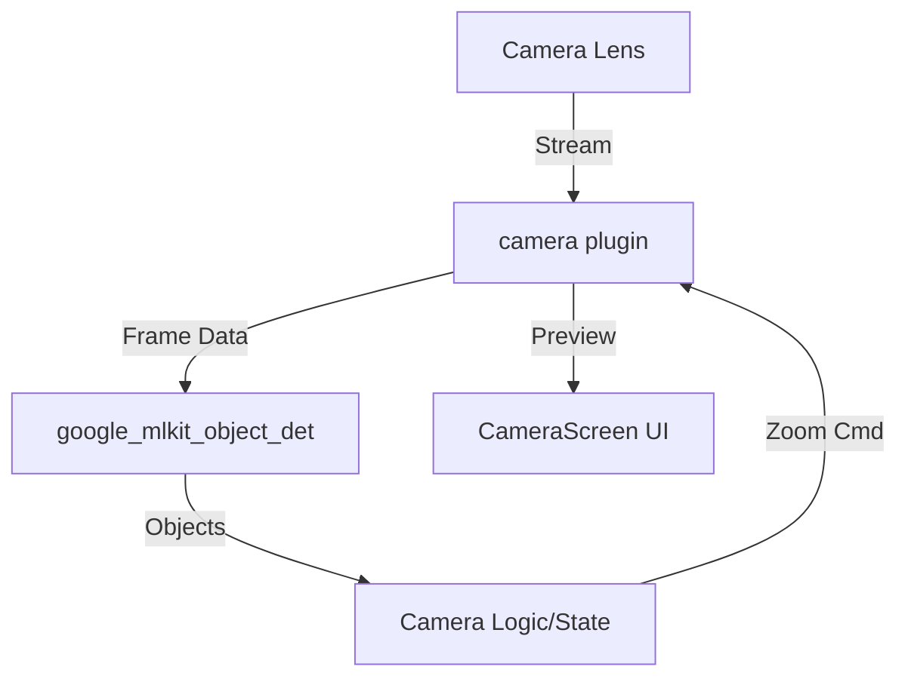
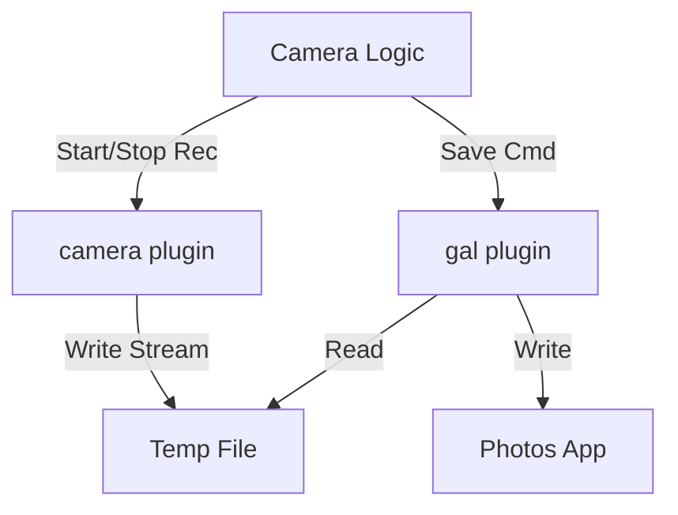
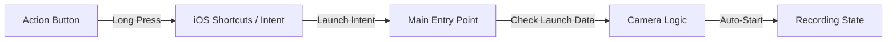
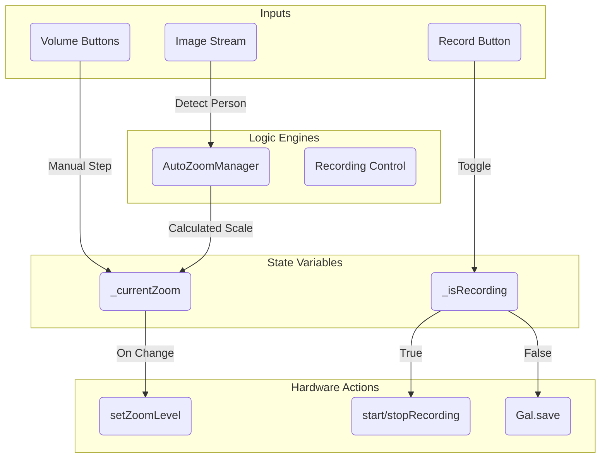
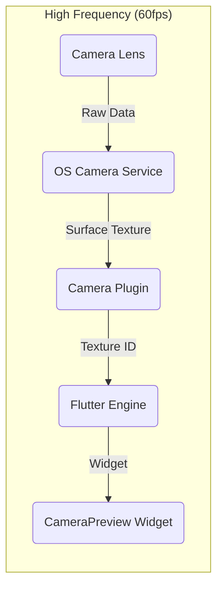
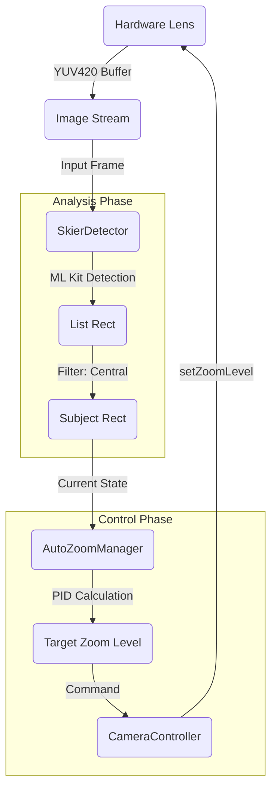
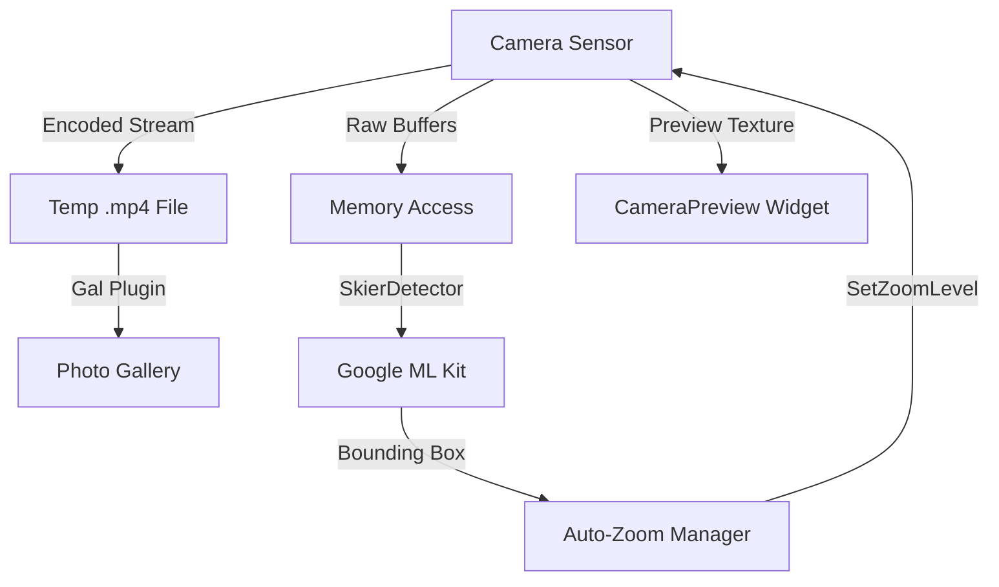

> [!IMPORTANT]
> This project has migrated from a Flutter-only implementation to a **Native Port** strategy.
> - For **Android Architecture**, see [ARCHITECTURE_ANDROID.md](file:///Users/vincentchoi/development/SkiCamera/ARCHITECTURE_ANDROID.md)
> - For **Auto-Zoom Algorithm** details, see [AUTOZOOM_ALGORITHM.md](file:///Users/vincentchoi/development/SkiCamera/AUTOZOOM_ALGORITHM.md)

## 1. High-Level System Overview

The SkiCamera app is a Flutter-based application designed for "Glove-On" usability. It leverages platform-specific hardware inputs (Volume Buttons, Action Button) to control camera functions without requiring precise touch interactions.

### System Context A: Camera & Intelligence Loop
*Focus: How the app sees, thinks, and zooming.*

### System Context B: Recording & Storage
*Focus: How video is captured and saved.*

### System Context C: Hardware Inputs (Volume)
*Focus: Glove-friendly zoom controls.*

### System Context D: One-Press Launch (Action Button)
*Focus: Immediate capture from locked state.*

### System Component Descriptions

| Component | Type | Description |
| :--- | :--- | :--- |
| **Volume Buttons** | Hardware Input | Physical buttons on the iPhone side used for manual zoom control (+/-). |
| **Action Button** | Hardware Input | The programmable side button (iPhone 15 Pro+) used to instantly launch the app and start recording. |
| **Main Entry Point** | App Layer | The Flutter `main()` function handles app initialization and routing. |
| **CameraScreen UI** | App Layer | The primary widget (`CameraScreen`) displaying the camera preview and overlays. |
| **Camera Logic & State** | App Layer | Manages app state (`isRecording`, `currentZoom`), handles inputs, and orchestrates the Auto-Zoom loop (`AutoZoomManager`). |
| **camera plugin** | Plugin | Official Flutter plugin (`camera`) providing access to the device's camera hardware (CameraX/AVFoundation). |
| **flutter_volume_controller** | Plugin | Plugin to intercept volume button presses for use as application triggers rather than system volume control. |
| **gal plugin** | Plugin | Plugin to save video files from the app's cache to the OS Gallery/Photos app. |
| **google_mlkit_object_detection** | Plugin | Plugin providing on-device ML for detecting and tracking objects (Skiers), represented as `SkierDetector`. |
| **Camera Lens / Sensor** | Hardware | The physical camera module capturing the video stream. |
| **Photos / Gallery** | OS / Hardware | The device's persistent storage for user-accessible media. |

## 2. Key Components

### A. UI Layer (`lib/camera_screen.dart`)
*   **Responsibility**: Renders the `CameraPreview` and status overlays (Zoom Level, Recording Indicator).
*   **State**: Manages `_isRecording`, `_currentZoomLevel`, and interactions.
*   **Wakelock**: Ensures the screen stays on during operation using `wakelock_plus`.

#### Camera Logic & State Detail
The `CameraScreenState` acts as the central orchestrator, managing the conflict between Manual Inputs and Auto-Zoom.

### B. Input Handling
*   **Volume Control**:
    *   **iOS**: Uses `flutter_volume_controller` to listen for volume changes and map them to Zoom In/Out.
    *   **Android**: Uses `MethodChannel` (`com.example.skicamera/volume`) to intercept hardware key events.
*   **Touch**: Minimal touch interface (optional tap support), primarily relies on hardware buttons.

### C. Skier Detection & Auto-Zoom (New)
*   **SkierDetector**: wrapper around `google_mlkit_object_detection`.
    *   **Input**: Camera Image Stream.
    *   **Logic**: Detects Objects (Label: "Person").
    *   **Selection**: Filters for the **Most Central** person (Euclidean distance to center).
    *   **Tracking**: Uses ML Kit's tracking ID to maintain lock.
    *   **Frequency**: Throttled to **~10-15 Hz** (processing every 3rd frame @ 30fps) to balance battery life and responsiveness.
*   **AutoZoomManager**:
    *   **Input**: Selected Skier's Bounding Box.
    *   **Logic**: Critically Damped PID Controller.
    *   **Output**: Calculated ideal Zoom Level.
    *   **Constraint**: Clamped to device min/max zoom.

### D. Camera Management
*   **Controller**: Uses the standard `camera` package `CameraController`.
*   **Zoom**: Calls `_controller.setZoomLevel()` triggered by volume events OR Auto-Zoom logic.
*   **Recording**: Calls `startVideoRecording()` and `stopVideoRecording()`.

### E. Storage
*   **Gal Plugin**: Handles saving the captured video file from the app's cache directory to the device's native Gallery/Photos app.

## 3. Data Flow Diagrams

### Diagram 1: Preview Pipeline
*Standard Camera Preview Flow*

### Diagram 2: Auto-Zoom Control Loop
*The Feedback Loop for keeping the skier framed*

## 4. User Interaction Model ("Glove-On" Priority)

This app is capable of being used entirely without precise touch interactions.

| Action | Hardware Control | Screen Control |
| :--- | :--- | :--- |
| **Start Recording** | **Auto-Start** (3s Delay)   *(Starts automatically after launch)* | **Full Screen Tap**   *(Manual override)* |
| **Stop Recording** | **Power Button** (Screen Lock)   *(App detects lifecycle `inactive` -> Save)* | **Full Screen Tap**   *(Manual override)* |
| **Zoom In** | **Volume Up** | - |
| **Zoom Out** | **Volume Down** | - |

> **Strategy**:
> 1.   **Launch**: User presses Action Button. App opens.
> 2.  **Countdown**: 3 second timer.
> 3.  **Action**: Recording starts automatically. Wakelock keeps screen on.
> 4.  **Stop**: User hits Power Button to lock screen. App catches `AppLifecycleState.inactive`, stops recording, saves, and suspends.

## 5. Camera Data Flow (Parallel Paths)

The system operates three parallel data paths to ensure smooth recording, intelligent tracking, and high-fps preview.

### Data Path Descriptions

| Path | Source | Destination | Mechanism |
| :--- | :--- | :--- | :--- |
| **Video Recording** | Hardware | Disk (Temp File) | The hardware writes encoded video directly to a temporary file via the OS camera session. |
| **Image Analysis** | Hardware | RAM (Memory) | Raw image buffers (NV21/BGRA) are streamed to memory and analyzed by ML Kit for subject tracking. |

## 6. Native Port & Shared Logic (The "Gold Standard")

To bypass the concurrency limitations of the Flutter `camera` plugin, the project has evolved into a hybrid architecture with 100% native platform implementations for the camera pipeline.

### Shared Logic Module (Kotlin Multiplatform)
Core mathematical logic is shared between iOS and Android to ensure behavior parity.
- **`native/shared`**: Contains `PIDController`, `SmoothingFilter`, and `AutoZoomManager`.
- **Target OS**: Android (Library) and iOS (XCFramework).

### Native Android App
- **CameraX**: Uses `ProcessCameraProvider` to bind `Preview`, `VideoCapture`, and `ImageAnalysis` concurrently. This allows high-quality recording while the AI analyzer runs in parallel without session drops.
- **ML Kit**: Native implementation of object detection for lowest latency.
- **Interactions**: Direct override of `onKeyDown` for volume control, ensuring reliability with gloves.
- **Auto-Start**: 3-second native timer for hands-free recording.

### Native iOS App (Future)
- **AVFoundation**: Direct use of `AVCaptureSession` for concurrent recording and analysis.
- **Vision/ML Kit**: Native iOS subject tracking.
