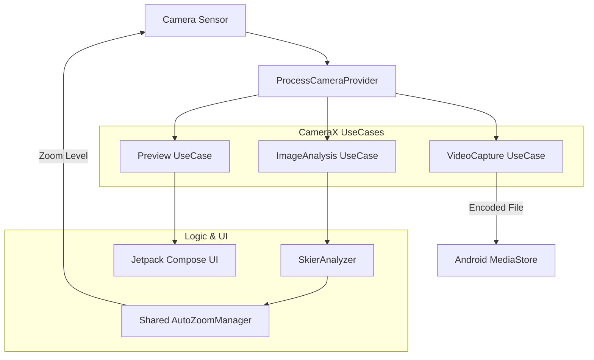

# SkiCamera Architecture - Native Android

This document details the architecture of the **Native Android** implementation of SkiCamera, which replaces the Flutter-based camera pipeline for superior performance and hardware control.

## 1. High-Level Native Pipeline

The Android implementation uses **CameraX** to manage simultaneous data streams. This ensures that video recording never interrupts the AI tracking loop.

## 2. Key Native Components

### A. CameraX Integration (`CameraScreen.kt`)
Unlike the Flutter plugin, CameraX allows us to bind multiple "UseCases" to the same lifecycle:
*   **Preview**: Provides the low-latency viewfinder.
*   **ImageAnalysis**: Streams raw buffers to our AI analyzer at a fixed resolution (e.g., 480x640) to save battery.
*   **VideoCapture**: Handles high-definition recording directly to disk.

### B. AI Analysis Pipeline (`SkierAnalyzer.kt`)
*   **Engine**: Google ML Kit (Object Detection & Tracking).
*   **Flow**:
    1.  Receives `ImageProxy` from CameraX.
    2.  Converts to `InputImage`.
    3.  Runs detection for "Person".
    4.  Normalizes bounding box coordinates to 0.0 - 1.0.
    5.  Feeds results into the **Shared KMP Manager**.

### C. Shared Logic Bridge (`AutoZoomManager`)
The "brain" is shared with the iOS app via Kotlin Multiplatform.
*   **KMP Module**: `SkiCameraAndroid/shared`
*   **Consumption**: The Android app calls `autoZoomManager.update(rect, dt)` and receives a normalized `Rect` representing the ideal crop.

### D. Native Interaction Model (`MainActivity.kt`)
*   **Volume Buttons**: Overrides `onKeyDown` to provide tactile zoom control. This works even when the UI is "frozen" or the screen is busy.
*   **Auto-Start**: A native coroutine delay (3s) triggers the `VideoCapture` session automatically after startup.

## 3. Data Flow Specifications

| Stage | Mechanism | Performance Priority |
| :--- | :--- | :--- |
| **Detection** | ML Kit (GPU/NNAPI) | Accuracy & Latency |
| **Zoom Control** | `cameraControl.setLinearZoom` | Smoothness |
| **Recording** | `venc` (Hardware Encoder) | Zero Frame Drops |
| **Persistance** | `MediaStore` | Reliable background writes |

## 4. Comparison with Flutter Architecture

| Feature | Flutter (Legacy) | Native Android (Current) |
| :--- | :--- | :--- |
| **Concurrency** | Fragile (Channel Locks) | Robust (Native UseCases) |
| **Latency** | Medium (Buffer Copies) | Low (Direct Memory Access) |
| **UI** | Widget-based | Jetpack Compose |
| **Hardware** | Plugin Abstraction | Direct OS API Access |
