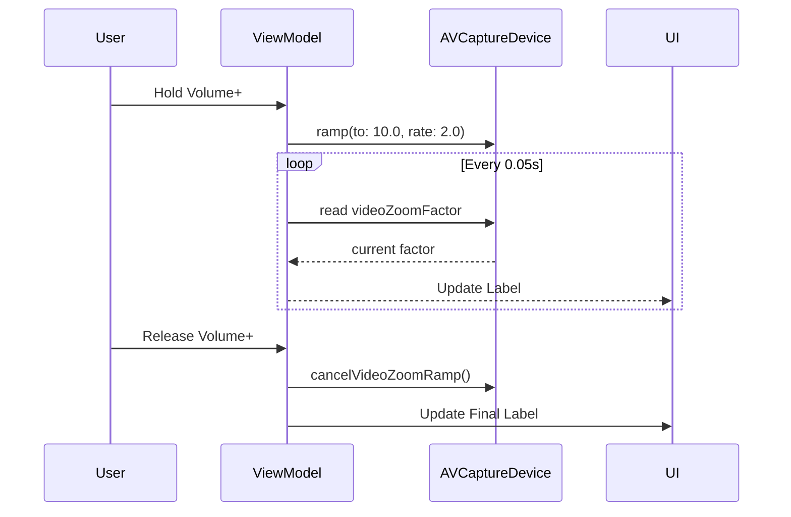

# SkiCamera iOS Architecture

> [!IMPORTANT]
> This document outlines the native iOS implementation of SkiCamera, focusing on the `LockedCameraCaptureExtension` and `AVFoundation` pipeline.
> For detailed technical flows, see [UI_FLOWS_AND_EVENTS.md](UI_FLOWS_AND_EVENTS.md).

## 1. System Overview

The iOS implementation is built using **SwiftUI** and **AVFoundation**, designed to run as a **Locked Camera Capture Extension** allowing immediate access from the lock screen.

### Core Components

| Component | Responsibility |
| :--- | :--- |
| **LockedCameraCaptureExtension** | Entry point for the lock screen experience. Hosts `ContentView`. |
| **MainViewModel** | Manages `AVCaptureSession` lifecycle, inputs (Camera, Mic), and outputs (VideoData, MovieFile). |
| **CamPreviewViewModel** | Handles the viewfinder UI, Auto-Zoom logic, and **Manual Zoom Ramping**. |
| **SkierAnalyzer** | Wraps Vision/CoreML to detect skiers (YOLOv8) and return bounding boxes. |
| **AutoZoomManager** | Shared logic (likely KMP or ported Swift) calculating ideal zoom targets. |

## 2. Lifecycle of a Capture Extension
 
 The Locked Camera Capture Extension follows a strict lifecycle distinct from a standard iOS app. It is designed to launch quickly, capture content, and then transition the user either back to the lock screen or into the main app.
 
 
 
 ### Key States:
 *   **Control**: The user taps the Control Center widget or Lock Screen button.
 *   **Launch**: The extension boots up. In our case, `LockedExtension.swift` initializes `LockedCameraCaptureView`.
 *   **Capture**: The user records video.
 *   **Dismissal**:
     *   **Lock Screen**: If the user swipes up or presses the power button, the extension is dismissed, and the device returns to the lock screen.
     *   **Transition to App**: If the user taps a button to "Open App", the extension hands off control to the main app (`SkiCameraIOSApp`).
 
 > [!NOTE]
 > For more details, refer to the WWDC session on Capture Controls.
 > 
 
 ## 3. Manual Zoom (Smooth Ramp)

To provide a premium, camera-like feel, manual zooming is implemented using hardware-accelerated ramping rather than discrete steps.

### Implementation Details
Traditional discrete zooming (e.g., `zoom += 0.1` in a loop) creates a jittery, stepped effect. SkiCamera uses `AVCaptureDevice`'s native ramp API to achieve fluid motion.

#### Logic Flow
1.  **Interaction**: User holds Volume Up (+) or Volume Down (-).
2.  **Start Ramp**:
    *   The app calls `device.ramp(toVideoZoomFactor: target, withRate: 2.0)`.
    *   `target` is either `minZoom` (1.0x) or `maxZoom` (e.g., 10.0x).
    *   `rate` of **2.0** means the zoom factor doubles every second (exponential feel) or increases by 2.0x units/sec (linear feel), providing a responsive yet controllable speed.
3.  **UI Feedback**:
    *   Since the hardware handles the value change internally, the `videoZoomFactor` property changes continuously without explicit "set" calls from our code.
    *   A lightweight `Timer` polls `device.videoZoomFactor` every **0.05s** to update the UI label in real-time.
4.  **Stop Ramp**:
    *   On button release, `device.cancelVideoZoomRamp()` is called.
    *   The lens holds position closest to the current instant.
    *   The polling timer is invalidated.



## 3. Video Pipeline

The application uses a singular `AVCaptureSession` to feed both the preview and the analysis engine simultaneously.

```mermaid
graph TD
    Lens[Camera Lens] -->|Input| Session[AVCaptureSession]
    Session -->|Preview Layer| Viewfinder[CameraPreview (UIView)]
    Session -->|VideoDataOutput| Analyzer[SkierAnalyzer]
    Session -->|MovieFileOutput| Recorder[File Storage]
    
    subgraph "Zoom Control"
        Analyzer -->|Rect| AutoZoom[AutoZoomManager]
        AutoZoom -->|Set| Lens
        User[Volume Buttons] -->|Ramp| Lens
    end
```

## 4. Data Storage Strategy

The application uses `PHAssetCreationRequest` to save videos directly to the **Photo Library**, even when launched from the lock screen.

| Launch State | Access Level | Storage Destination |
| :--- | :--- | :--- |
| **Unlocked (Main App)** | Full | **Photo Library** (`PHAssetCreationRequest`) |
| **Locked (Extension)** | Restricted | **Session Container** (`session.sessionContentURL`) |

### Unlocked Capture Logic
When the app is launched normally (unlocked), it has full access to system resources.
1.  **Config**: `AppStorageConfigProvider` initializes with `isLockedCapture = false`.
2.  **Save**: `CaptureProcessor` uses `PHAssetCreationRequest` to save the video directly to the user's **Photo Library**.
3.  **No Import Needed**: The file is immediately available in the Photos app.

### Locked Capture Logic
When the device is locked, the `LockedCameraCaptureExtension` runs in a restricted sandbox that **cannot access the Photo Library**. To persist videos:

1.  **Detection**: `AppStorageConfigProvider` detects the locked state (`isLockedCapture = true`) when initialized with a `LockedCameraCaptureSession`.
2.  **Redirect**: `CaptureProcessor` checks this flag.
3.  **Save**: Instead of calling `PHPhotoLibrary`, it performs a file copy to `session.sessionContentURL`.
    *   Files in this directory are temporarily persisted by the system in a shared container.
4.  **Logging**: Detailed debug logs are printed to verify the save operation:
    ```
    Locked Capture: Successfully saved video.
      - Source: file:///private/var/.../tmp/video.mov
      - Destination: file:///private/var/.../LockedCameraCapture/session_id/video.mov
      - Size: 1845293 bytes
    ```

### Import on Unlock (Main App)
Since locked videos are not immediately visible in Photos, the **Main App** is responsible for importing them when the user unlocks the device.

1.  **Launch**: `SkiCameraIOSApp` (DemoApp.swift) initializes `SessionImporter`.
2.  **Scan**: It scans `LockedCameraCaptureManager.shared.sessionContentURLs` for any existing sessions.
3.  **Import**: It iterates through found directories, saves `.mov` files to the **Photo Library**, and deletes the originals to free up space.
4. log debug message "Found session at URL: ..."

This ensures a seamless experience: Users record quickly from the lock screen, and the videos appear in their Photos library as soon as they unlock the app.
## 5. User Interface & Debug Overlay

To assist with testing and verification in the field, a dense debug overlay is rendered on top of the camera preview.

#### 1. Heads-Up Display (HUD)
**availability**: Locked & Unlocked
Located at the top-left of the screen, providing real-time telemetry:
*   **Zoom Mode**: `AUTO ZOOM` (Green) or `MANUAL ZOOM` (Orange).
*   **Locked State**: `LOCKED` (Red) or `UNLOCKED` (Green).
*   **Storage**: Number of files in temp storage (e.g., `Files: 3`).
*   **Skier Height**: Estimated normalized height of the tracked skier (0.0 - 1.0).
*   **Zoom Factor**: True hardware video zoom factor (e.g., `2.50x`).

#### 2. Import Button (Main App Only)
Because the locked extension cannot access the photo library, an **Import Overlay** appears in the main app when triggered:
*   **Trigger**: App launch or `sessionImporter.scanForSessions()`.
*   **Condition**: Valid video files found in the shared `sessionContentURL` container.
*   **UI**:
    *   **Info Box**: "Found **X** Ski Videos" (Top Center).
    *   **Action Button**: "Click to Import" (Yellow Button).
    *   **Behavior**: Tapping the button saves videos to Photos and deletes the temp files.

#### 3. Bounding Boxes
*   **Gray Box**: All person detections returned by YOLOv8.
*   **Green Box**: The specific "Primary Target" selected by the tracking algorithm (closest to center/largest).

## 6. Verification Test Cases

### Locked Capture & Power Button Stop
This test verifies that the app correctly handles the "Power Button to Stop" lifecycle event, which is common in skiing scenarios (saving battery).

1.  **Start (Locked)**: Launch app via Action Button or Control Center in **Locked State**.
2.  **Record**: Wait for countdown (or press Volume Down) to start recording.
3.  **Stop (Power Off)**: Press the **Power Button** once. This should:
    *   Stop the recording.
    *   Lock the screen and turn off the display.
    *   **Crucial**: The `CaptureProcessor` must catch the stop event and save the video to the Session Container despite the app entering the background.
4.  **Verify (Unlocked)**: Unlock the phone and open the **Main SkiCamera App**.
5.  **Check UI**:
    *   Look for the **Import Overlay** at the top.
    *   It should read **"Found 1 Ski Videos"**.
6.  **Import**: Tap **"Click to Import"**.
    *   Status should change to "Importing...".
    *   Button should disappear after completion.
7.  **Final Check**: Open **Photos App** and verify the new video is present.
