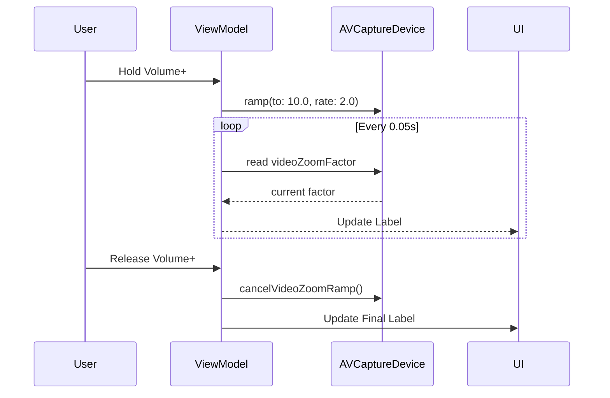

# SkiCamera iOS Architecture

> [!IMPORTANT]
> This document outlines the native iOS implementation of SkiCamera, focusing on the `LockedCameraCaptureExtension` and `AVFoundation` pipeline.

## 1. System Overview

The iOS implementation is built using **SwiftUI** and **AVFoundation**, designed to run as a **Locked Camera Capture Extension** allowing immediate access from the lock screen.

### Core Components

| Component | Responsibility |
| :--- | :--- |
| **LockedCameraCaptureExtension** | Entry point for the lock screen experience. Hosts `ContentView`. |
| **MainViewModel** | Manages `AVCaptureSession` lifecycle, inputs (Camera, Mic), and outputs (VideoData, MovieFile). |
| **CamPreviewViewModel** | Handles the viewfinder UI, Auto-Zoom logic, and **Manual Zoom Ramping**. |
| **SkierAnalyzer** | Wraps Vision/CoreML to detect skiers (YOLOv8) and return bounding boxes. |
| **AutoZoomManager** | Shared logic (likely KMP or ported Swift) calculating ideal zoom targets. |

## 2. Manual Zoom (Smooth Ramp)

To provide a premium, camera-like feel, manual zooming is implemented using hardware-accelerated ramping rather than discrete steps.

### Implementation Details
Traditional discrete zooming (e.g., `zoom += 0.1` in a loop) creates a jittery, stepped effect. SkiCamera uses `AVCaptureDevice`'s native ramp API to achieve fluid motion.

#### Logic Flow
1.  **Interaction**: User holds Volume Up (+) or Volume Down (-).
2.  **Start Ramp**:
    *   The app calls `device.ramp(toVideoZoomFactor: target, withRate: 2.0)`.
    *   `target` is either `minZoom` (1.0x) or `maxZoom` (e.g., 10.0x).
    *   `rate` of **2.0** means the zoom factor doubles every second (exponential feel) or increases by 2.0x units/sec (linear feel), providing a responsive yet controllable speed.
3.  **UI Feedback**:
    *   Since the hardware handles the value change internally, the `videoZoomFactor` property changes continuously without explicit "set" calls from our code.
    *   A lightweight `Timer` polls `device.videoZoomFactor` every **0.05s** to update the UI label in real-time.
4.  **Stop Ramp**:
    *   On button release, `device.cancelVideoZoomRamp()` is called.
    *   The lens holds position closest to the current instant.
    *   The polling timer is invalidated.



## 3. Video Pipeline

The application uses a singular `AVCaptureSession` to feed both the preview and the analysis engine simultaneously.

```mermaid
graph TD
    Lens[Camera Lens] -->|Input| Session[AVCaptureSession]
    Session -->|Preview Layer| Viewfinder[CameraPreview (UIView)]
    Session -->|VideoDataOutput| Analyzer[SkierAnalyzer]
    Session -->|MovieFileOutput| Recorder[File Storage]
    
    subgraph "Zoom Control"
        Analyzer -->|Rect| AutoZoom[AutoZoomManager]
        AutoZoom -->|Set| Lens
        User[Volume Buttons] -->|Ramp| Lens
    end
```
