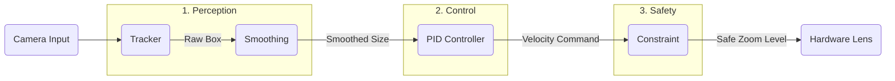

# Auto-Zoom Algorithm: Critically Damped PID Controller

> [!NOTE]
> This algorithm is implemented as a **Cross-Platform Shared Module** using Kotlin Multiplatform (KMP). The core logic in `native/shared` is consumed by both the Native Android and Native iOS applications to ensure identical framing behavior across devices.

## 1. Core Concept
To create a smooth auto-zoom for a skier without overshoot, we utilize a **Critically Damped PID Controller**. This approach treats the zoom level as a physical system with "mass" and "friction," ensuring the lens arrives at the target zoom level quickly but stops precisely on target.

Critical damping ($\zeta = 1$) is the specific tuning where a system returns to its target in the shortest possible time without crossing (overshooting) it.

**The "Error"**: The difference between the **Target Zoom** (the zoom level where the skier occupies a specific % of the frame) and the **Current Zoom**.

## 2. Algorithm Strategy

The algorithm runs in a loop (e.g., 30 or 60 Hz) following these three phases:

### Phase A: Subject Detection (The Input)
1.  **Detection**: Use **YOLOv8** (Nano or Small) for real-time object detection.
    *   **Rationale**: YOLOv8 offers superior reliability for detecting small, distant, or partially occluded subjects (common in skiing) compared to MediaPipe Pose, which is optimized for larger, full-body subjects. MediaPipe Pose is used optionally for skeletal visualization but not for the primary tracking loop.
    *   **iOS Implementation**: MUST convert the model to **CoreML** format (`.mlpackage`) with **Non-Maximum Suppression (NMS)** baked in. This allows the model to run on the **Apple Neural Engine (ANE)**, ensuring high performance (>60 FPS) and low battery consumption. Raw PyTorch models on CPU are not viable.
2.  **Subject Selection (ByteTrack)**:
    *   **Logic**: We use **ByteTrack** (via YOLOv8) which employs a Kalman Filter to track subjects across frames.
    *   **First Lock**: Select the person closest to the **Frame Center** and assign them a `Target ID`.
    *   **Tracking**: In subsequent frames, look specifically for the subject with the `Target ID`.
    *   **Recovery**: If the `Target ID` is lost (e.g., extended occlusion), the system falls back to finding the closest candidate to the last known position to re-initialize tracking.
    *   **Benefit**: Robustly handles mutual occlusion (skiers crossing paths) and brief disappearances (behind trees or snow spray).
3.  **Current Scale ($S_{current}$)**:
    $$ S_{current} = \frac{\text{Height of Skier Bounding Box}}{\text{Total Frame Height}} $$
4.  **Target Scale ($S_{target}$)**: Define the desired proportion of the frame the skier should fill (e.g., 0.15 or 15%).

### Phase B: The Control Logic (The Brain)
We use a **PD Controller (Proportional-Derivative)** tuned for critical damping. The Integral (I) term is skipped to avoid overshoot in fast-moving scenarios.

**Formula for Zoom Velocity ($v$)**:
$$ v(t) = K_p \cdot \text{Error} + K_d \cdot \frac{d(\text{Error})}{dt} $$

**Tuning for Critical Damping**:
$$ K_d = 2\sqrt{K_p} $$

*   **$K_p$ (Proportional)**: Determines reactiveness. Start low.
*   **$K_d$ (Derivative)**: Acts as the "brake." By setting $K_d = 2\sqrt{K_p}$, the zoom slows down perfectly as it approaches the target.

### Phase C: Logarithmic Scaling (The Output)
Human perception of zoom is logarithmic, not linear (1x to 2x feels the same as 4x to 8x).

*   **Rule**: Apply the control algorithm to the **log** of the zoom level. This prevents the "rushing" feeling when zooming in from far away and ensures visual consistency.

## 3. Implementation Steps

| Component | Recommendation | Why? |
| :--- | :--- | :--- |
| **Tracker** | ByteTrack (Kalman Filter) | Uses motion prediction to maintain ID across frames. Handles crossing paths and occlusion better than simple sticky tracking. |
| **Smoothing** | Exponential Moving Average (EMA) | Raw bounding box data is jittery. Smooth the input before feeding it to the PID. |
| **Constraint** | Rate Limiter | Limit the max "Zoom Speed" to avoid motion sickness. |

## 4. Execution Flow
1.  **Detect**: Get skier bounding box height.
2.  **Smooth**: Apply 3-5 frame moving average to the height value.
3.  **Calculate Error**: Diff between smoothed height and desired height (e.g., 400 pixels).
4.  **Compute Scale Change**: Use the critically damped formula ($K_d = 2\sqrt{K_p}$).
5.  **Update Zoom**: Apply change using logarithmic scaling.

## 5. System Architecture

The complete module pipeline consists of these four distinct blocks:

### Component I/O Specifications

| Component | Input Parameters | Output Parameters | purpose |
| :--- | :--- | :--- | :--- |
| **1. Tracker** | • Video Frame `(ImageBuffer)` • Previous State `(List<Track>)` | • Bounding Box `Rect(x, y, w, h)` • Confidence Score `(float)` | Detects skier and maintains ID across frames. |
| **2. Smoothing** | • Raw Box Height `h_raw` (px) • Alpha `α` (0.1 - 0.3) • **Previous Smoothed Height** `h_prev` | • Smoothed Height `h_smooth` (px) | Reduces high-frequency jitter from detection noise. |
| **3. PID Controller** | • Target Height `h_target` (px) • Smoothed Height `h_smooth` (px) • Delta Time `dt` (sec) | • Zoom Velocity `v_zoom` (factor/sec) | Calculates how fast to change zoom to minimize error. |
| **4. Constraint** | • Raw Velocity `v_zoom` • Max Speed Limit `v_max` | • Safe Velocity `v_final` | Prevents nausea by clamping extreme zoom speeds. |

#### Data Structure Definitions
*   **Track Object**: Represents one identified skier over time.
    *   `id`: Unique Integer (e.g., #42).
    *   `bbox`: The current position `Rect(x,y,w,h)`.
    *   `kalman_state`: Internal matrix representing velocity/covariance (used to predict where box will be next frame).
    *   `missed_frames`: Counter. If > 30, we delete this track (skier left the mountain).

## 6. Handling Camera Panning (Lateral Movement)
Since the camera operator will pan to follow the skier, we must adjust the algorithm to distinguish **Subject Motion** vs **Camera Motion**.

1.  **Ignore Horizontal Position**: The zoom algorithm should calculate scale based **only on Bounding Box Height**, not width or x-position.
2.  **Pan-Tilt-Zoom (PTZ) Compensation**:
    *   **Problem**: If the camera pans fast, the bounding box might blur or temporarily deform.
    *   **Solution**: The **Smoothing** component handles this.
    *   **Deadband**: We do NOT auto-center the subject. We assume the human operator does the framing. We *only* control the Zoom dimension.
3.  **"Lost Subject" Logic**:
    *   If the skier moves out of frame (due to bad panning), the tracker will loose them.
    *   **Action**: If tracking is lost, **HOLD** current zoom. Do NOT zoom out to search (this looks chaotic in video). Wait for re-acquisition.

## 7. Auto-Pan (Digital Stabilization)
To support "Auto-Pan" where the algorithm respects the operator's framing (e.g., keeping subject on the right vs. center):

### The Concept: "Proportional Framing"
Instead of forcing the subject to `Center (0.5, 0.5)`, we use a **Proportional Panning** Strategy.

1.  **Proportional Mapping**:
    *   The center of the **Zoomed Crop** matches the **Relative Position** of the skier in the **Full Frame**.
    *   If the skier is at 90% right in the full frame, the crop centers at 90% right.
    *   $$ P_{crop\_center} = P_{skier\_in\_full\_frame} $$

2.  **Why?**:
    *   This preserves the "relative positioning" chosen by the operator.
    *   It effectively locks the subject in place relative to the screen borders, without the lag of a PID controller for panning.
    *   PIDs are used *only* for the Zoom axis; Pan is direct (smoothed) mapping.

**PID Control**:
*   **Zoom**: Critically Damped PID.
*   **Pan**: Bypassed (Direct Proportional Mapping).

## 8. Calibration & Testing Module
To verify the smooth mechanics without hitting the slopes, we will build a **Real-Time Interactive Simulator**.

### A. Input Simulation (The "Virtual Skier")
*   **Mouse/Slider Control**: Drag a dot around a canvas to represent the Skier's position (`x`, `y`).
*   **Scroll Wheel**: Change the dot size to simulate the skier coming closer or moving away (`w`, `h`).
*   **Noise Generator**: Toggle a button to add random "jitter" to the dot's position/size (simulating sensor noise) to test the Smoothing filter.

### B. Visualization (The "Viewfinder")
*   **Outer Rectangle (Gray)**: Represents the **Full 4K Sensor**.
*   **Green Dot**: The **Virtual Skier** (Input).
*   **Blue Rectangle**: The **Digital Crop (Output)** determined by the PID.
    *   *Goal*: The Blue Box should follow the Green Dot smoothly.

### C. Tuning Inspector
*   **Real-Time Graphs**:
    *   Chart 1: **Zoom Level** (Target vs. Actual).
    *   Chart 2: **Pan Position** (Target vs. Actual).
*   **PID Sliders**:
    *   Adjust `Kp` (Reaction Speed) and `Kd` (Damping/Braking) on the fly.
    *   Toggle `Constraint` on/off to see motion sickness effects.

## 9. Current Configuration Parameters
(As of Jan 2026 Implementation)

### A. Performance Throttling
*   **Frame Skip**: `1 in 1` (No Skip)
    *   **Logic**: `frameCounter % 1 == 0`
    *   **Effect**: Max smoothness. Analysis Rate matches Camera FPS (e.g., 60 FPS).

### B. Zoom Physics (`AutoZoomManager`)
*   **Delta Time (`dt`) Calculation**:
    *   **Formula**: `dt = (1.0 / CameraFPS) * FrameSkipInterval`
    *   **Logic**: Since we skip frames, we must tell the PID controller that *more time has passed* between updates.
    *   **Example**: At 60 FPS with 1-frame skip, `dt` = 0.0167s (Standard). This maintains correct zoom velocity.

*   **Target Subject Height**: `0.15` (15% of frame height)
    *   **Effect**: The algorithm aims to keep the skier occupying 15% of the screen vertical height.
*   **Zoom Gain (`kZoom`)**: `10.0`
    *   **Effect**: Controls reaction speed to size errors. Higher values = faster/snappier zoom, lower values = slower/smoother.
*   **Smoothing Alpha**: `0.2`
    *   **Effect**: Low-pass filter for Subject H/X/Y. `0.2` means the new detection contributes 20% to the current state, and 80% is retained history. Reduces jitter from bounding box noise.

### C. Constraints
*   **Max Zoom**: `20x` (Scale 0.05)
*   **Min Zoom**: `1x` (Scale 1.0)
*   **Manual Ramp Rate**: `2.0`
    *   **Effect**: When holding Volume Buttons, the zoom factor changes by 2.0x per second.

### D. Hysteresis (Deadband)
*   **Trigger Threshold**: `0.10` (10% Error)
    *   **Logic**: Zoom **STARTS** only if `abs(target - current) > 0.10`.
    *   **Purpose**: Prevents the lens from hunting when the subject size is changing slightly (e.g., breathing, minor posture changes).
*   **Stop Threshold**: `0.05` (5% Error)
    *   **Logic**: Zoom **STOPS** only if `abs(target - current) < 0.05`.
    *   **Purpose**: Ensures the zoom settles completely once active, preventing "chatter" (rapid start/stop).

