# Auto-Zoom Algorithm: Critically Damped PID Controller

> [!NOTE]
> This algorithm is implemented as a **Cross-Platform Shared Module** using Kotlin Multiplatform (KMP). The core logic in `native/shared` is consumed by both the Native Android and Native iOS applications to ensure identical framing behavior across devices.

## 1. Objective
To create a smooth auto-zoom for a skier without overshoot, we utilize a **Critically Damped PID Controller**. This approach treats the zoom level as a physical system with "mass" and "friction," ensuring the lens arrives at the target zoom level quickly but stops precisely on target.

Critical damping ($\zeta = 1$) is the specific tuning where a system returns to its target in the shortest possible time without crossing (overshooting) it.

**The "Error"**: The difference between the **Target Zoom** (the zoom level where the skier occupies a specific % of the frame) and the **Current Zoom**.

## 2. Execution Pipeline

The complete module pipeline involves a tightly coupled interaction between the perception system (Tracker/Smoothing), the decision system (Hysteresis), and the control system (PID).

### A. Architectural Diagram

```mermaid
graph LR
    A("Camera Input") --> B1("Detection")
    B1 -->|"Raw List"| B2("Selection")
    B2 -->|"Target Box"| C("Smoothing")
    C -->|"Smoothed Size"| T("Target Calc")
    T -->|"Raw Error"| H("Hysteresis Gate")
    H -->|"Active Error"| D("PID Controller")
    D -->|"Linear Velocity"| L("Log Scaling")
    L -->|"Log Velocity"| E("Constraint")
    E -->|"Safe Zoom Level"| F("Hardware Lens")
    
    subgraph "1. Perception"
    B1
    B2
    C
    T
    H
    end
    
    subgraph "2. Control"
    D
    L
    end
    
    subgraph "3. Safety"
    E
    end
```

### B. Execution Flow Steps
1.  **Detection**: Detect objects (YOLOv8) in the frame.
2.  **Subject Selection**: Use ByteTrack + Center Proximity bias to select the primary target.
3.  **Smoothing**: Apply Exponential Moving Average (EMA) to the bounding box dimensions.
4.  **Target Calculation**: Compare `Current Zoom` vs `Target Zoom` to find the Raw Error.
5.  **Gatekeeper (Hysteresis)**: 
    *   If `Stable`: Check if `Error > Start Threshold` (0.10).
    *   If `Zooming`: Check if `Error < Stop Threshold` (0.05).
6.  **Control Logic**: Feed the Active Error into the **PD Controller** to compute `Zoom Velocity`.
7.  **Log Scaling**: Map linear velocity to logarithmic zoom scale (human perception).
8.  **Constraint**: Apply Rate Limiting (`v_max`) to prevent motion sickness.
9.  **Update Zoom**: Send final zoom command to hardware lens.

## 3. Component Details Needs

### 1. Detection (The Input)
*   **Logic**: Use **YOLOv8** (Nano or Small) for real-time object detection.
*   **iOS Implementation**: MUST convert to **CoreML** with **NMS** baked in to use the **Apple Neural Engine (ANE)**.
*   **Rationale**: Superior reliability for small/distant subjects compared to MediaPipe Pose.

### 2. Subject Selection (ByteTrack)
*   **Logic**:
    1.  **YOLOv8 ("The Eye")**: Detects *all* candidate objects. Returns a list of `Rect`s with confidence scores.
    2.  **ByteTrack ("The Memory")**: A robust multi-object tracking algorithm.
        *   **Kalman Filter**: Predicts the next position of each track to handle occlusions and missing detections.
        *   **Dual-Stage Matching**:
            *   **Stage 1**: Matches High Confidence (>0.5) detections to existing tracks using IoU.
            *   **Stage 2**: Matches Low Confidence (0.1-0.5) detections to "Lost" tracks. This "rescues" skiers who are partially occluded or far away (low detection score) but effectively tracked.
*   **Target Locking**: The system assigns a persistent ID. If the locked target is lost briefly, the Kalman Filter keeps the track alive. If lost for >1s, we fall back to the closest-to-center subject.
*   **Benefit**: Robustly handles mutual occlusion (skiers crossing paths) and low-visibility conditions.

### 3. Smoothing (EMA)
*   **Logic**: Apply Exponential Moving Average (EMA) or simple rolling average to raw bounding box dimensions.
*   **Purpose**: Raw detection boxes jitter frame-to-frame. Smoothing prevents this noise from being amplified by the PID controller.

### 4. Target Calculation
*   **Current Scale**: Skier Height / Frame Height.
*   **Target Scale**: Desired fill percentage (e.g., 0.15).
*   **Raw Error**: Target Scale - Current Scale.

### 5. Hysteresis (The Gatekeeper)
To prevent "hunting" or "breathing" (constant micro-adjustments), we apply a Schmitt Trigger logic using **Relative Error**:
1.  **Stable State**: Zoom **STARTS** only if the *Relative Error* > **15%**. (e.g., if Target is 0.15, Error must be > 0.0225).
2.  **Zooming State**: Zoom **STOPS** only if the *Relative Error* < **5%**.
3.  **Why Relative?**: A fixed absolute error (e.g., 0.10) is too large for small subjects. 10% screen height error on a small skier is massive. Relative % ensures consistent responsiveness at all zoom levels.

### 6. Control Logic (PID)
We use a **PD Controller (Proportional-Derivative)** tuned for critical damping.
*   **Formula**: $v(t) = K_p \cdot \text{Error} + K_d \cdot \frac{d(\text{Error})}{dt}$
*   **Critical Damping**: $K_d = 2\sqrt{K_p}$. This ensures the zoom slows down perfectly as it approaches the target without overshooting.

### 7. Logarithmic Scaling
*   **Rule**: Multiply the calculated velocity by the **current zoom scale** (`currentZoomScale`).
*   **Why**: Human perception is logarithmic. A linear change of 0.1 is huge at 1.0 scale (10%) but tiny at 0.1 scale (1% of original frame). Multiplying by the current scale ensures the zoom velocity is always a constant **percentage** of the current frame size, making 1x -> 2x feel identical to 10x -> 20x.

### 8. Constraint (Safety)
*   **Rate Limiter**: Clamps the maximum zoom velocity.
*   **Purpose**: Preventing motion sickness and ensuring the hardware lens motor is not overdriven.

### Component I/O Specifications

| Component | Input Parameters | Output Parameters | Purpose |
| :--- | :--- | :--- | :--- |
| **1. Detection** | • Video Frame `(ImageBuffer)` | • List of Detections `[Rect, Class, Conf]` | Runs YOLOv8 to find all potential objects. |
| **2. Selection** | • Detections • Previous Track History | • Primary Target `Rect` | ByteTrack logic + Centrality to pick *the* skier. |
| **3. Smoothing** | • Target Box Dimensions | • Smoothed Dimensions `h_smooth` | Reduces high-frequency jitter from detection noise. |
| **4. Target Calc** | • Smoothed Height • Target % (0.15) | • Raw Error `(Target - Current)` | Calculates how far off the zoom is. |
| **5. Hysteresis** | • Raw Error • Current State | • Active Error `(0 if clamped)` | Prevents start/stop chatter (Deadband). |
| **6. PID Controller** | • Active Error • Delta Time `dt` | • Linear Velocity `v_lin` | Calculates corrective action speed. |
| **7. Log Scaling** | • Linear Velocity `v_lin` • Current Zoom `z` | • Log Velocity `v_log` | Maps speed to human-perceived scale. |
| **8. Constraint** | • Log Velocity `v_log` • Safety Limits | • Final Zoom Level | Prevents nausea and hardware overrun. |

#### Data Structure Definitions
*   **Track Object (ByteTrack)**:
    *   `id`: Unique Integer (e.g., #42).
    *   `rect`: The current position `Rect(x,y,w,h)`.
    *   `kalman_filter`: Stores state vector (pos + velocity) and covariance matrix.
    *   `state`: New, Tracked, Lost, or Removed.
    *   `missed_frames`: Counter. Max 30 frames tolerance.

## 4. Handling Camera Panning (Lateral Movement)
Since the camera operator will pan to follow the skier, we must adjust the algorithm to distinguish **Subject Motion** vs **Camera Motion**.

1.  **Ignore Horizontal Position**: The zoom algorithm should calculate scale based **only on Bounding Box Height**, not width or x-position.
2.  **Pan-Tilt-Zoom (PTZ) Compensation**:
    *   **Problem**: If the camera pans fast, the bounding box might blur or temporarily deform.
    *   **Solution**: The **Smoothing** component handles this.
    *   **Deadband**: We do NOT auto-center the subject. We assume the human operator does the framing. We *only* control the Zoom dimension.
3.  **"Lost Subject" Logic**:
    *   If the skier moves out of frame (due to bad panning), the tracker will loose them.
    *   **Action**: If tracking is lost, **HOLD** current zoom. Do NOT zoom out to search (this looks chaotic in video). Wait for re-acquisition.

## 5. Auto-Pan (Digital Stabilization)
To support "Auto-Pan" where the algorithm respects the operator's framing (e.g., keeping subject on the right vs. center):

### The Concept: "Proportional Framing"
Instead of forcing the subject to `Center (0.5, 0.5)`, we use a **Proportional Panning** Strategy.

1.  **Proportional Mapping**:
    *   The center of the **Zoomed Crop** matches the **Relative Position** of the skier in the **Full Frame**.
    *   If the skier is at 90% right in the full frame, the crop centers at 90% right.
    *   $$ P_{crop\_center} = P_{skier\_in\_full\_frame} $$

2.  **Why?**:
    *   This preserves the "relative positioning" chosen by the operator.
    *   It effectively locks the subject in place relative to the screen borders, without the lag of a PID controller for panning.
    *   PIDs are used *only* for the Zoom axis; Pan is direct (smoothed) mapping.

**PID Control**:
*   **Zoom**: Critically Damped PID.
*   **Pan**: Bypassed (Direct Proportional Mapping).

## 6. Calibration & Testing Module
To verify the smooth mechanics without hitting the slopes, we will build a **Real-Time Interactive Simulator**.

### A. Input Simulation (The "Virtual Skier")
*   **Mouse/Slider Control**: Drag a dot around a canvas to represent the Skier's position (`x`, `y`).
*   **Scroll Wheel**: Change the dot size to simulate the skier coming closer or moving away (`w`, `h`).
*   **Noise Generator**: Toggle a button to add random "jitter" to the dot's position/size (simulating sensor noise) to test the Smoothing filter.

### B. Visualization (The "Viewfinder")
*   **Outer Rectangle (Gray)**: Represents the **Full 4K Sensor**.
*   **Green Dot**: The **Virtual Skier** (Input).
*   **Blue Rectangle**: The **Digital Crop (Output)** determined by the PID.
    *   *Goal*: The Blue Box should follow the Green Dot smoothly.

### C. Tuning Inspector
*   **Real-Time Graphs**:
    *   Chart 1: **Zoom Level** (Target vs. Actual).
    *   Chart 2: **Pan Position** (Target vs. Actual).
*   **PID Sliders**:
    *   Adjust `Kp` (Reaction Speed) and `Kd` (Damping/Braking) on the fly.
    *   Toggle `Constraint` on/off to see motion sickness effects.

## 7. Current Configuration Parameters
(As of Jan 2026 Implementation)

### A. Performance Throttling
*   **Frame Skip**: `1 in 1` (No Skip)
    *   **Logic**: `frameCounter % 1 == 0`
    *   **Effect**: Max smoothness. Analysis Rate matches Camera FPS (e.g., 60 FPS).

### B. Zoom Physics (`AutoZoomManager`)
*   **Delta Time (`dt`) Calculation**:
    *   **Formula**: `dt = (1.0 / CameraFPS) * FrameSkipInterval`
    *   **Logic**: Since we skip frames, we must tell the PID controller that *more time has passed* between updates.
    *   **Example**: At 60 FPS with 1-frame skip, `dt` = 0.0167s (Standard). This maintains correct zoom velocity.

*   **Target Subject Height**: `0.15` (15% of frame height)
    *   **Effect**: The algorithm aims to keep the skier occupying 15% of the screen vertical height.
*   **Zoom Gain (`kZoom`)**: `10.0`
    *   **Effect**: Controls reaction speed to size errors. Higher values = faster/snappier zoom, lower values = slower/smoother.
*   **Smoothing Alpha**: `0.2`
    *   **Effect**: Low-pass filter for Subject H/X/Y. `0.2` means the new detection contributes 20% to the current state, and 80% is retained history. Reduces jitter from bounding box noise.

### C. Constraints
*   **Max Zoom**: `20x` (Scale 0.05)
*   **Min Zoom**: `1x` (Scale 1.0)
*   **Manual Ramp Rate**: `2.0`
    *   **Effect**: When holding Volume Buttons, the zoom factor changes by 2.0x per second.

### D. Hysteresis (Deadband)
*   **Trigger Threshold**: `0.15` (15% Relative Error)
    *   **Logic**: Zoom **STARTS** only if `relative_error > 0.15`.
    *   **Purpose**: Prevents the lens from hunting when the subject size is changing slightly (e.g., breathing, minor posture changes).
*   **Stop Threshold**: `0.05` (5% Relative Error)
    *   **Logic**: Zoom **STOPS** only if `relative_error < 0.05`.
    *   **Purpose**: Ensures the zoom settles completely once active, preventing "chatter" (rapid start/stop).

