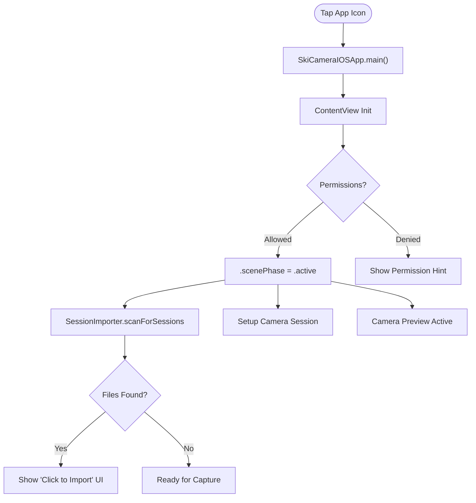
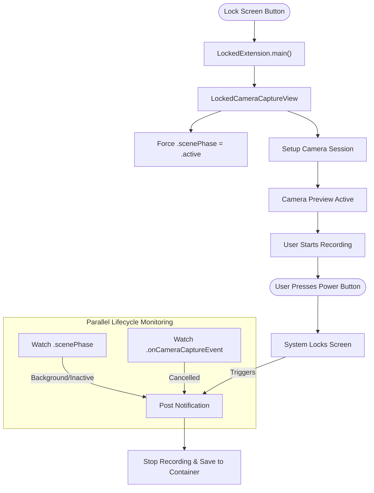

# UI Flows & Event Processing Logic

This document details the interaction flows, system events, and processing logic within the **SkiCamera iOS** application.

## 1. Master Event Processing Reference

A consolidated list of all significant code events and their execution chains.

<table width="100%">
  <thead>
    <tr>
      <th width="8%">Category</th>
      <th width="8%">Event Source</th>
      <th width="15%">Event / Trigger</th>
      <th width="15%">Trigger Location</th>
      <th width="44%">Processing Chain</th>
      <th width="10%">Details</th>
    </tr>
  </thead>
  <tbody>
    <tr>
      <td><b>Lifecycle</b></td>
      <td>System</td>
      <td><b>App Launch (Unlocked)</b></td>
      <td><code>SkiCameraIOSApp</code></td>
      <td><code>ContentView.init</code> &rarr; <code>.task(scenePhase)</code> &rarr; <code>sessionImporter.scanForSessions()</code></td>
      <td><a href="#21-unlocked-launch-main-app">Link</a></td>
    </tr>
    <tr>
      <td><b>Lifecycle</b></td>
      <td>System</td>
      <td><b>Extension Launch (Locked)</b></td>
      <td><code>LockedExtension</code></td>
      <td><code>LockedExtension.init</code> &rarr; <code>LockedCameraCaptureView</code> &rarr; Force Active Phase &rarr; <code>ContentView</code></td>
      <td><a href="#22-locked-launch-extension">Link</a></td>
    </tr>
    <tr>
      <td><b>Lifecycle</b></td>
      <td>Hardware</td>
      <td><b>Power Button (Lock)</b></td>
      <td><code>LockedExtension</code></td>
      <td><code>scenePhase</code> becomes <code>.inactive</code> &rarr; Post <code>LockedCameraStopRecording</code> Notification</td>
      <td><a href="#41-power-button--screen-lock-critical">Link</a></td>
    </tr>
    <tr>
      <td><b>Lifecycle</b></td>
      <td>Hardware</td>
      <td><b>System Interruption</b></td>
      <td><code>LockedExtension</code></td>
      <td><code>.onCameraCaptureEvent(.cancelled)</code> &rarr; Post <code>LockedCameraStopRecording</code> Notification</td>
      <td><a href="#42-capture-cancellation">Link</a></td>
    </tr>
    <tr>
      <td><b>Lifecycle</b></td>
      <td>Internal</td>
      <td><b>Stop Notification</b></td>
      <td><code>ContentView</code></td>
      <td><code>.onReceive("LockedCameraStopRecording")</code> &rarr; <code>viewModel.stopRecording()</code> &rarr; <code>stopCamera()</code></td>
      <td><a href="#41-power-button--screen-lock-critical">Link</a></td>
    </tr>
    <tr>
      <td><b>Input</b></td>
      <td>User</td>
      <td><b>Volume Up (Press)</b></td>
      <td><code>ContentView</code></td>
      <td><code>.onPressCapture</code> &rarr; <code>previewViewModel.startZoomingIn()</code> &rarr; <code>device.ramp(to: max)</code></td>
      <td><a href="#31-volume-buttons-zoom--recording">Link</a></td>
    </tr>
    <tr>
      <td><b>Input</b></td>
      <td>User</td>
      <td><b>Volume Down (Press)</b></td>
      <td><code>ContentView</code></td>
      <td><code>.onPressCapture</code> &rarr; <code>previewViewModel.startZoomingOut()</code> &rarr; <code>device.ramp(to: min)</code></td>
      <td><a href="#31-volume-buttons-zoom--recording">Link</a></td>
    </tr>
    <tr>
      <td><b>Input</b></td>
      <td>User</td>
      <td><b>Volume (Release)</b></td>
      <td><code>ContentView</code></td>
      <td><code>.onPressCapture</code> &rarr; <code>previewViewModel.stopZooming()</code> &rarr; <code>device.cancelVideoZoomRamp()</code></td>
      <td><a href="#31-volume-buttons-zoom--recording">Link</a></td>
    </tr>
    <tr>
      <td><b>Input</b></td>
      <td>User</td>
      <td><b>Volume (Double Click)</b></td>
      <td><code>ContentView</code></td>
      <td><code>.onPressCapture</code> (Time Check &lt; 0.4s) &rarr; <code>viewModel.stopRecording()</code></td>
      <td><a href="#31-volume-buttons-zoom--recording">Link</a></td>
    </tr>
    <tr>
      <td><b>Input</b></td>
      <td>User</td>
      <td><b>Tap Import Button</b></td>
      <td><code>ContentView</code></td>
      <td><code>SessionImporter.performImport()</code> &rarr; Save to <code>PHPhotoLibrary</code> &rarr; Delete Temp File</td>
      <td><a href="#32-on-screen-ui">Link</a></td>
    </tr>
    <tr>
      <td><b>Data</b></td>
      <td>Camera</td>
      <td><b>Frame Arrived</b></td>
      <td><code>AVCaptureVideoDataOutput</code></td>
      <td><b>Frame Arrived</b></td>
      <td><code>AVCaptureVideoDataOutput</code></td>
      <td><code>FrameDistributor.captureOutput</code> &rarr; <b>Update Preview</b> (Main Thread) &rarr; <b>Throttle (1/3)</b> &rarr; <code>AutoZoomService</code> (Async)</td>
      <td><a href="#52-auto-zoom-analysis">Link</a></td>
    </tr>
    <tr>
      <td><b>Data</b></td>
      <td>Recorder</td>
      <td><b>Save Finished</b></td>
      <td><code>CaptureProcessor</code></td>
      <td><code>fileOutput(_:didFinishRecordingTo:)</code> &rarr; Check Locked State &rarr; Copy to Session Container</td>
      <td><a href="#51-video-recording--saving">Link</a></td>
    </tr>
    <tr>
      <td><b>Timer</b></td>
      <td>System</td>
      <td><b>Countdown (5s)</b></td>
      <td><code>ContentView</code></td>
      <td><code>.task(scenePhase)</code> &rarr; Loop (5..0) &rarr; <code>viewModel.startRecording()</code></td>
      <td><a href="#32-on-screen-ui">Link</a></td>
    </tr>
    <tr>
      <td><b>Timer</b></td>
      <td>System</td>
      <td><b>Manual Zoom UI</b></td>
      <td><code>CamPreviewViewModel</code></td>
      <td><code>Timer(0.05s)</code> &rarr; <code>updateZoomUI()</code> &rarr; Updates <code>currentZoom</code> @Published</td>
      <td><a href="#31-volume-buttons-zoom--recording">Link</a></td>
    </tr>
  </tbody>
</table>

---

## 2. Application Launch & Lifecycle

The app has two distinct entry points with different capabilities and lifecycle constraints.

### 2.1 Unlocked Launch (Main App)
**Entry Point**: Tapping the App Icon from Home Screen.
**Context**: Full system access, long-running.

### 2.2 Locked Launch (Extension)
**Entry Point**: Lock Screen Button or Control Center Widget.
**Context**: Restricted "Sandbox", finite lifecycle, no Photo Library access.

---

## 3. User Input Processing

Inputs are handled primarily in `ContentView.swift` via the `.onPressCapture` modifier and standard SwiftUI buttons.

### 3.1 Volume Buttons (Zoom & Recording)
**Logic Location**: `ContentView.onPressCapture`

| Input | State | Action | Processing Logic |
| :--- | :--- | :--- | :--- |
| **Volume Up (Hold)** | Preview | **Zoom In** | `CamPreviewViewModel.startZoomingIn()` initiates hardware ramp. |
| **Volume Down (Hold)** | Preview | **Zoom Out** | `CamPreviewViewModel.startZoomingOut()` initiates hardware ramp. |
| **Simultaneous Press** | Preview | **Reset Zoom** | If `isVolUpPressed && isVolDownPressed`, trigger `resetToAutoZoom()`. |
| **Double Click (Either)** | Recording | **Stop Recording** | Checks timestamp of last press (`< 0.4s`). If true, triggers `viewModel.stopRecording()`. |
| **Manual Zoom UI** | Ramp | **Update Slider** | `Timer(0.05s)` updates `currentZoom` to reflect hardware position. |

### 3.2 On-Screen UI
**Logic Location**: `ContentView.overlay`

| Element | Trigger | Action | Processing Logic |
| :--- | :--- | :--- | :--- |
| **Import Button** | Tap | **Import Videos** | Calls `SessionImporter.performImport()`. Moves files from Shared Container to Photos Library. |
| **Stop Button** | Tap | **Stop Recording** | Calls `viewModel.stopRecording()`. Updates UI state `isRecording = false`. |
| **Countdown** | Auto | **Start Recording** | `ContentView` loop counts down from 5, then triggers `startRecording()`. |

---

## 4. System Event Processing

System events allow the app to react to hardware changes and lifecycle transitions even when user interaction handling is suspended.

### 4.1 Power Button / Screen Lock (Critical)
**Problem**: When the user presses the power button to lock the screen, the extension is suspended immediately. Standard `.onDisappear` may not fire in time to save data.
**Solution**: Proactive Scene Phase Monitoring in `LockedExtension.swift`.

1.  **Event**: User presses Power Button.
2.  **Detection**: `LockedExtension` observes the **real** system `.scenePhase` transition to `.inactive`.
3.  **Signal**: It posts a `Notification.Name("LockedCameraStopRecording")`.
4.  **Reaction**: `ContentView` (which is forced `.active`) listens for this notification.
    *   **Action**: Calls `viewModel.stopRecording()`.
    *   **Cleanup**: Calls `viewModel.stopCamera()` to release hardware.

### 4.2 Capture Cancellation
**Problem**: The system may unilaterally cancel the capture session (e.g., incoming call, resource pressure).
**Solution**: `.onCameraCaptureEvent` modifier.

1.  **Event**: System cancels capture.
2.  **Detection**: `.onCameraCaptureEvent` receives `.cancelled` phase.
3.  **Action**: Posts `Notification.Name("LockedCameraStopRecording")` as a failsafe to ensure recording is saved.

---

## 5. Data Processing Pipelines

### 5.1 Video Recording & Saving
**Class**: `CaptureProcessor`

1.  **Input**: `AVCaptureMovieFileOutput` receives video data.
2.  **Stop**: `stopRecording()` is called.
3.  **Delegate**: `fileOutput(_:didFinishRecordingTo:...)` is triggered.
4.  **Decision**:
    *   **IF Unlocked**: Use `PHAssetCreationRequest` to save directly to **Photos Library**.
    *   **IF Locked**:
        *   Locate `session.sessionContentURL` (Shared Container).
        *   Copy temp file to this container.
        *   **Log**: "Locked Capture: Successfully saved video..."

### 5.2 Auto-Zoom Analysis
**Class**: `AutoZoomService` (via `FrameDistributor`)

1.  **Distribution**: `FrameDistributor.captureOutput` receives `CMSampleBuffer`.
2.  **Fast Path**: `Buffer` sent to `CamPreviewViewModel` to update UI Preview (Immediate, Main Thread).
3.  **Slow Path**: `Buffer` sent to `AutoZoomService.processFrame` (Async Queue).
4.  **Throttle**: `AutoZoomService` checks if `frameCounter % 3 == 0`. Skips 66% of frames.
5.  **Detection**: `SkierAnalyzer` (YOLOv8) detects person.
6.  **Zoom**: `AutoZoomManager` calculates new zoom level.
7.  **Apply**: Service sets `device.videoZoomFactor`.
4.  **Tracking**: ByteTrack algorithm assigns IDs to detected persons.
5.  **Selection**: "Primary Target" is selected based on centrality and size.
6.  **Calc**: Bounding box is converted to a zoom rectangle.
7.  **Output**: `CamPreviewViewModel` updates the camera zoom factor using `device.ramp(toVideoZoomFactor: ...)`.

### 5.3 Session Import
**Class**: `SessionImporter`

1.  **Trigger**: App Launch or Manual Refresh.
2.  **Scan**: Checks `LockedCameraCaptureManager.shared.sessionContentURLs`.
3.  **List**: Enumerates `.mov` files. Update UI "Found X Files".
4.  **Import**:
    *   Request Photos Permission.
    *   Save file to Photos.
    *   **Delete** original file from Shared Container (Crucial for storage management).
